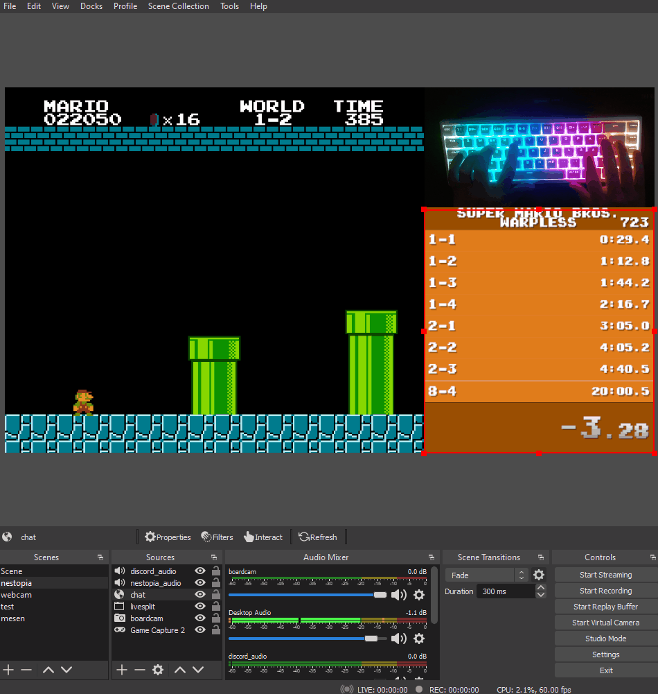

# Twchat
Very simple & customizable twitch chat.  


## Usage
1. Download Rwchat from the releases category. Extract it to a folder.
2. Change the channel in 'index.js'
```javascript
const client = new tmi.Client({
	options: { debug: false },
    connection: {
        secure: true,
        reconnect: true
    },
	channels: [ 'channel' ] // <-- change this (keep the quotes)!
});
```
3. In OBS add a "Browser" scene and use "Local File" and select the "index.html"

## Customization
In "Custom CSS" the classes can be changed; which are.  
``message`` which has the background for the message and contains the following classes,  
``message_author`` contains badges, and the name of the user,  
``message_text`` contains the text sent by the user.   

Example:
```css
.message
{
    background-color: gray;
    border-color: white;
    border-style: solid;
    border-radius: 16px;
    opacity: 0.8;
}
.message_author
{
    font-size: 38px;
    font-family: "Comic Sans MS", "Arial"; /* Use 'Arial' if Comic Sans wasn't found */
}
.message_text
{
    font-size: 28px;
    font-family: "Comic Sans MS";
}
```

## Licences
- Rwchat ([WTFPL](./LICENCE))
- JQuery ([MIT](https://jquery.org/license/))
- tmijs ([MIT](https://github.com/tmijs/tmi.js/blob/main/LICENSE))
